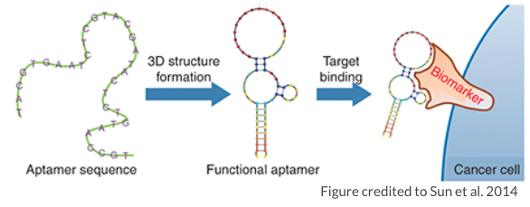
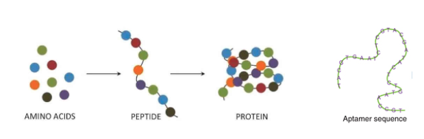
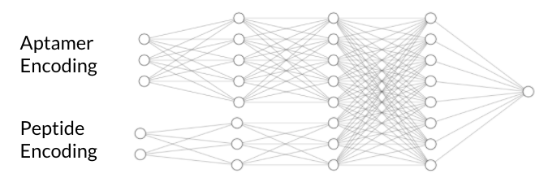
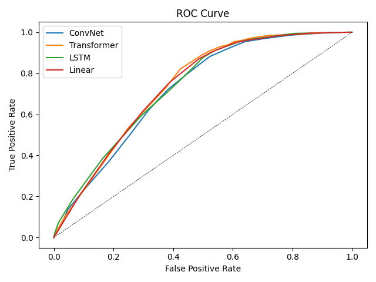

# CSE599 DL Project
Group Members: Pengfei He, Xin Lin, Ruoqi Shen, Yuhao Wan

[Video](https://youtu.be/AKPR1_6LrbA)

[Slides for Video](https://docs.google.com/presentation/d/1-pIZbwpHI7QhcoElQwVMxiXptjwinfOuZBJZyBOTWIY/edit?usp=sharing)

## Abstract
In drug design and medical diagnostics, researchers often use peptide-binding aptamers as vehicles to deliver drugs or diagnostic substances to target peptides. 
However, the process of identifying such aptamer-peptide binding can be inefficient and time consuming. 
We use deep learning techniques to facilitate the process of binding identification and reduce labor cost. 
In our project, we tried different deep learning models to identify the possible aptamers that can bind with a certain peptide. We also tried different embedding methods to encode the aptamers and peptide. 

## Data Set
We are using a biological dataset that has aptamer-peptide pairs generated by the web lab in UW CSE. We have four independent replicates of an experiment, each consists of two sets of aptamer-peptide pairs, positive and negative pairs. 

Each sequencing pair results from a "molecular snapshot" taken during each experiment and readout with high-throughput DNA sequencing, where a large pool of aptamers were mixed with a large library of nearly random, mRNA-labeled peptides. When this snapshot is taken on the positives, an aptamer that is physically close to a peptide has a higher chance of being paired with that peptide's mRNA sequence in the dataset, than to any other random peptide present in the pool. From the peptide's mRNA open reading frame, we can infer its peptide sequence. The outcome of this process is that aptamer-peptide pairs that bind with higher affinities will more likely be close to each other when the snapshot is taken. However, there is a non-zero possibility that a given aptamer-peptide pair is near to one another by chance (i.e., random diffusion) or for other reasons specific to the experimental setup that are not due to aptamer-peptide binding. 
The positive set of aptamer-peptide pairs may or may not have interacted due to high affinity aptamer-peptide interactions. 

The negative dataset was generated when peptides were removed from the experiment and only the mRNA was included along with the aptamers. In this case, the experiment still generates a molecular snapshot of aptamer-peptide pairs, but we know this co-occurrence and association are completely independent of an aptamer-peptide binding event. The negatives can be used as a negative control.

## Method
Due to the structure difference between aptamers and peptides, encoding aptamers and peptides seperately enables better model performance. Therefore, we apply encoding seperately on them and use a two head neural net architecture. 

Based on this notion, we experiment linear model, convolution model and Long short-term memory(LSTM). We have two types of embedding, initialized embedding and pre-trained embedding from [the work using Transformer to predict masked amino acid](https://www.biorxiv.org/content/10.1101/622803v1.full.pdf) for peptides. We don't find any pre-trained aptamer embedding available.

* **Linear** We initialized aptamers' embedding dimension to 4 and peptides' dimension to 20. The decision of embedding dimensions is based on their vocabulary size. First, aptamers are unlike words and have much richer structural information. Second, one-hot vector doesn't provides information other than distinction and embedding offers more flexibility. Also, we test the model performance for different dimensions. After getting the embedding, we pass embedding to multi-layer perceptron and finally output a value of binding probability.
* **ConvNet** We initialized aptamers' embedding dimension to 4 and peptides' dimension to 20, same as in linear model. Aptamers and peptides sequences are fed into two separate convolutional layers with kernel size 4. The outputs of the two convolutional layers are then concatenated and classified using two fully connected layers.
* **LSTM** In this model, we initialized the embedding dimension of aptamers to 16 and use pre-trained peptide embedding of dimension (3, 1024). We run two LSTMs as two encoders and obtain two hidden states. We set the hidden dimensions of the aptamer encoder and the peptide encoder to 100 and 300 separately. We then pass the final hidden state to a fully connected layer and output a probability of binding. In this experimental work, we only run the model for 10 epochs due to slow computation resulting from large embedding dimension.

## Result
### ROC Curve
We measure the performance of our models using receiver operating characteristic (ROC) curve. We test our model using positive, negative and generated data. The ROC curve shows that the performance of the three models are very similar. 

